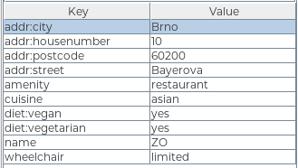
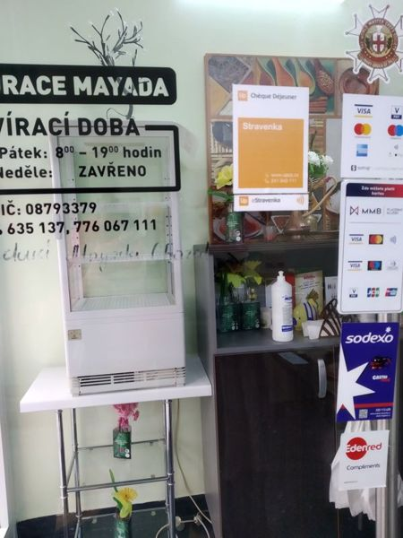
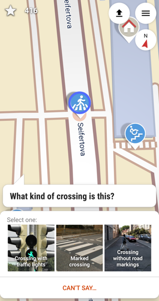
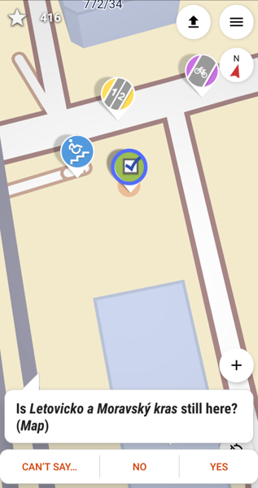

Title: Like Columbus but better
Date: 2021-02-15 17:48
Category: OpenStreetMap
Tags: mapping, EN
Slug: like-columbus-but-better

It's hard for me to go out without a purpose.
Hiking in the forests, meeting some other people - count me in.
Trying all the tram routes in the city - of course. 

But then the pandemic comes. Or there is no one available in the city.
Or you've seen all of the tram, bus, trolley, and city train routes. 

That could be a reason to stop leaving the flat. 

I hacked this laziness of mine by starting editing [OpenStreetMap](https://www.openstreetmap.org/). 
The map isn't primarily a map - it's a big open source database.
That means **anyone** can edit it, and there is plenty of possibilities, from very easy to quite complicated ones. 

## Where you've encountered OSM

If you think you don't know OpenStreetMap, you're probably wrong.

This is the default map used on Facebook. 
(They seem to have forgotten to attach the license attribution. 
Those little distracted heads!)

You may know one of the popular offline mobile applications, [OsmAnd](https://wiki.openstreetmap.org/wiki/OsmAnd).
If you don't, try it. 
It has some great features helping with planning mountain hiking, especially altitude profile.

The well-known maps in Czechia, [mapy.cz](https://en.mapy.cz/), use OpenStreetMap for showing foreign countries data. 

## Editing map 

First we need to talk about where to get source information from.

### Data source
As a general rule one mustn't map out of proprietary data sources like Google Maps.
The objects that are added to map should be ones you've checked yourself - **you went there and saw it with your own eyes**. 
It's called "survey" or "local knowledge" in the data sources and it's the most important thing you should know about OSM.

No automatic imports, no drawing from satellite photos when editing Czechia or broadly: Europe.
It's a community project and anyone can become a contributor.

### Point of interest (POI)
Each point of interest (like shop, bar, cinema), line (streets) or polygon (buildings, areas) consist of tags.
A tag is a key-value pair. 

Drawing paths can be also fun, but today I will focus on editing POIs only.

_example tagging of a POI - restaurant_

Many of us have a thing or two that are important for us in the city. 
It may be **wheelchair accessibility**, **free parking**, **public toilets**, **recycling points**, **outdoor seating** or type of diet in the restaurants.

A protip gratis: There is no sense in trying to map everything around you, you'll become exhausted and demotivated very soon.
Pick something you care for or is fun for you.
 It's better to be a constant contributor on small changes than big one-time shot.

One of my things is adding vegan places to the map.
Whenever a restaurant has a considerable amount of vegan meal on menu, I take a photo of the door labels and edit it at home.
As you can see in the image above, the respective key is "diet:vegan" and the value should be one of _yes_, _no_, _only_.

_when editing a restaurant at home, I update all the information, not only diet_

### Mapping the defaults
There is an issue with _no_, though. 
The original philosophy of OSM was: we don't map defaults. 
So if in Czechia the default is "no vegan options", we shouldn't add the tag "diet:vegan=no" to map.
For the same reason one shouldn't map for example the possibility to pay with cash. 

These days it changes, mostly because of rising popularity of mobile applications like StreetComplete, which gamify the tag hunt. 
The more people use them, the more defaults are being mapped and it seems there is hardly anything that can be done to prevent the trend.

The defaults may be also interesting for people building their own applications on the top of OSM data, eg. rendering 3D city models.
As a side note, beware typos, it may end up like [in this case](https://www.engadget.com/flight-simulator-open-street-map-building-205545509.html).

### Finding your tag
OSM has got a tremendous [Wiki](https://wiki.openstreetmap.org/wiki/Main_Page). It so big it's overwhelming.
One of the greatest features there are the tags explanations.

It happens a lot to me that I'm not sure how to tag a particular thing. 
When preparing a talk, I was looking for a dog hairdresser to build a _funny_ example.
Typing "dog hairdresser tag osm" to my favorite search engine resulted in an immediate shot: [the answer](https://wiki.openstreetmap.org/wiki/Tag:shop%3Dpet_grooming).

I highly recommend diving into the Wiki to look for the answers.

### Editors

To edit maps you need to create a free account on [OpenStreetMap](https://www.openstreetmap.org/). 

Then you can edit: 

- directly in the web browser using iD editor. See [guide](https://learnosm.org/en/beginner/id-editor/) for more details.
- using a desktop application, like [JOSM](https://josm.openstreetmap.de/). See [guide](https://learnosm.org/en/josm/) for more details.

Once you find an object you want to edit, you are free to add, edit or remove a desired tag.

I mentioned [StreetComplete](https://wiki.openstreetmap.org/wiki/StreetComplete) earlier, that's another approach to OSM.
It's a mobile application (available on both F-Droid and Play Store).
Here you don't plan what to add to map, it's designed the opposite way: it navigates you through quests in the city. 
When you walk past a quest, you can answer a simple question: "Is XXX still here?" or "What kind of YYY is here?"
There is gazillion types of quests, I have disabled around half of them. :) 

  

Every time you upload some of the answers, you get plenty of stars and some achievements get unlocked. 
You may find yourself hunting the quests in the places you'd otherwise never go. 

Consider yourself warned.
