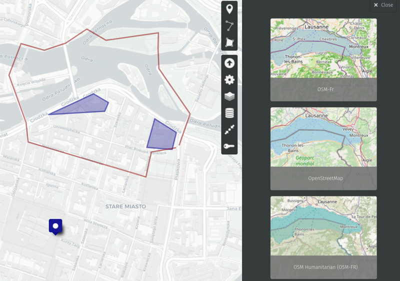
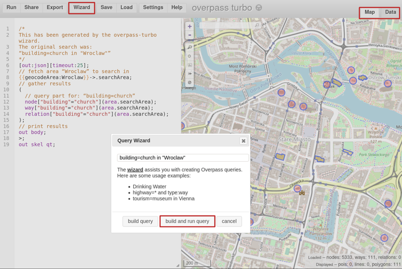
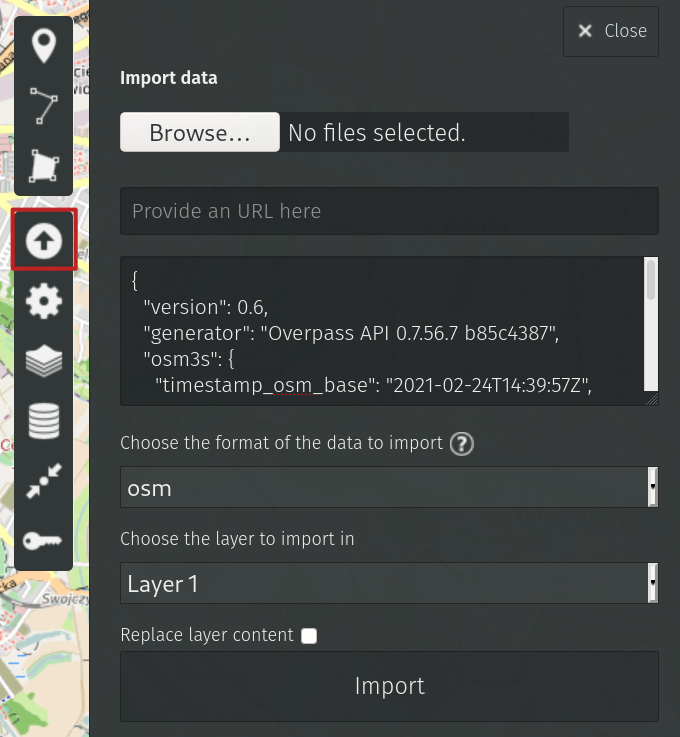

Title: Draw a map! (1/2)
Date: 2021-02-24 14:38
Category: OpenStreetMap
Tags: mapping, uMap, EN
Slug: draw-a-map-1


## uMap

[uMap](https://umap.openstreetmap.fr/en/) is a tool to create custom maps on the OpenStreetMap layers.
In order to start creating maps, one needs to have an **OSM account** and click on "Create a map" on the uMap homepage.
There is a few possibilities how to get data to the map.

### Language course in Wrocław

Your friend is going to Wrocław for a language course. 
They want to know where to eat the best _pierogi_ in the city. 
You want to show them additionally the _campus area_ as well as some best _walking routes_.

Requirements:

- you need a pinpoint, shape and line drawings on the map
- the map shouldn't change: once you finish your edits, that's it

All of this is achievable with the three options on the top-right map menu.
Additionally, one can change the background to the most suiting the needs of the moment.



The final map can be embedded to your site with a piece of HTML code.
See the same example as interactive map:

<iframe width="100%" height="600px" frameborder="0" allowfullscreen src="//umap.openstreetmap.fr/en/map/wrocaw-pierogi_567141?scaleControl=false&miniMap=false&scrollWheelZoom=false&zoomControl=true&allowEdit=false&moreControl=true&searchControl=null&tilelayersControl=null&embedControl=null&datalayersControl=true&onLoadPanel=undefined&captionBar=false"></iframe><p><a href="//umap.openstreetmap.fr/en/map/wrocaw-pierogi_567141">See full screen</a></p>

### Use case 2

Your friend now knows where to go to learn, drink beer and eat pierogi.

Let's keep it even more stereotypical.

They heard that there is plenty of old churches there and they want to take a look at some of them.
It's Poland so marking each church manually might be a tedious task.
It would be good to be able to **bulk import data about churches**.

Requirements:

- no more drawing manually, automation needed
- the map shouldn't change: once you finish your edits, that's it

The useful tool for the task is [Overpass Turbo](https://overpass-turbo.eu/#) which runs queries to OSM database and returns the results as JSON files.

First, you need to establish what we're looking for. 
Using your favorite search engine for "church tag OSM" will lead you to [this Wiki page](https://wiki.openstreetmap.org/wiki/Tag:building%3Dchurch). 

It's time to go and ask Overpass Wizard about "building=church in Wroclaw".
When the query is ready, click "Build and run query".

There is, as expected, plenty of results. Overpass shows them by default as a map layer but there is another tab available - Data. 



> Important note
> 
> For objects that are not nodes, but polygons (as churches and other buildings often are), uMap doesn't work properly yet. 
> 
> In order to make it work, you shall change the query in the left panel.
Replace the lines 17-19:
> ```
> out body;
> out skel qt;
> ```
> with 
> ```
> out center qt;
> ```
> and click the button Run on the top-left menu.
> This will ensure that each polygon has a central point and can be drawn on map.


Clicking on "Data" panel you'll see them formatted as JSON. How convenient! 
Let's copy and paste the data to uMap.

In the import field there is plenty of possibilities: data can be imported from **file**, **url** or **directly** to the map. 
Let's paste it directly. Format in this case should be _osm_ and the layer to import is up to you.



Click "Import" et Voila!

<iframe width="100%" height="600px" frameborder="0" allowfullscreen src="//umap.openstreetmap.fr/en/map/one-time-import_567160?scaleControl=false&miniMap=false&scrollWheelZoom=false&zoomControl=true&allowEdit=false&moreControl=true&searchControl=null&tilelayersControl=null&embedControl=null&datalayersControl=true&onLoadPanel=undefined&captionBar=false"></iframe><p><a href="//umap.openstreetmap.fr/en/map/one-time-import_567160">See full screen</a></p>

> Note that it's perfectly possible to import data to the first map as another data layer and provide your friend with both hand-drawn and imported objects.

## Final words

Neither of maps will ever change (unless you edit them manually).
The next time we'll take a look at how to ensure the data is updated automatically on a regular basis.

