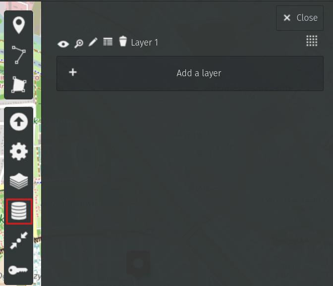
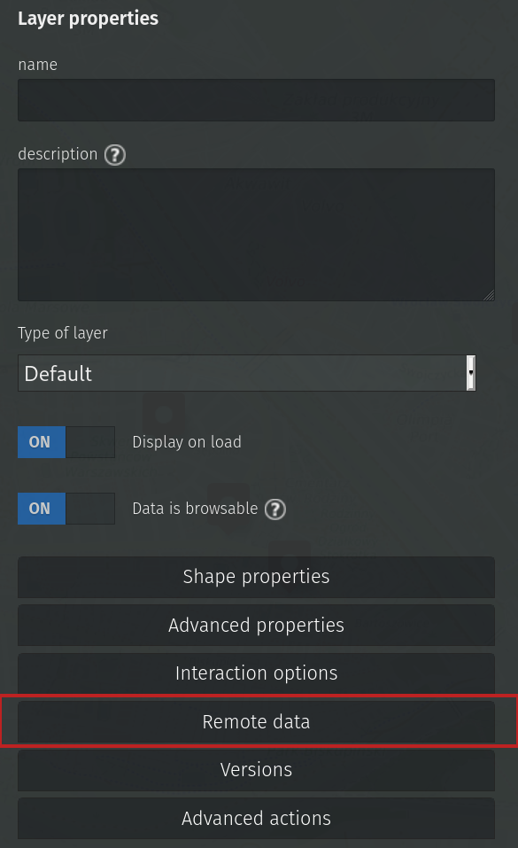
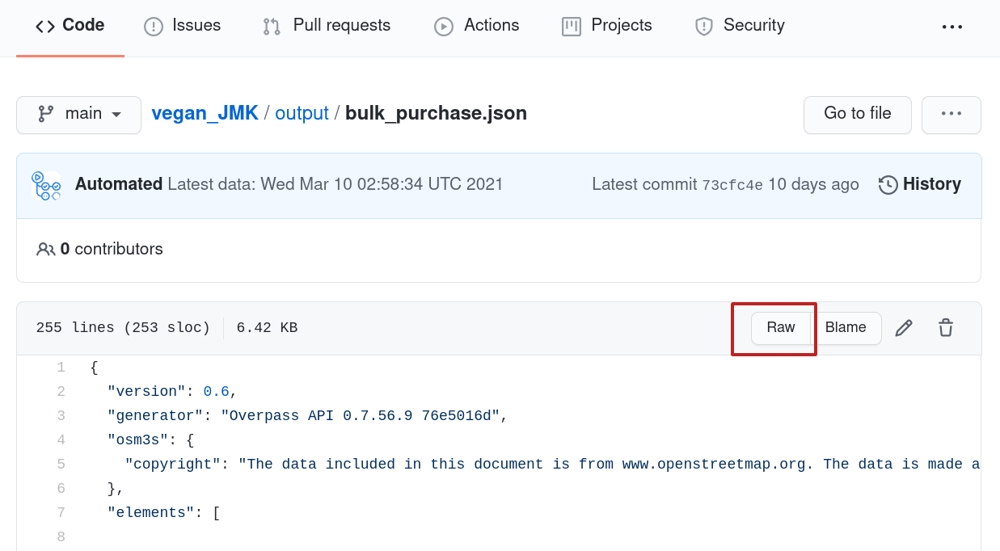
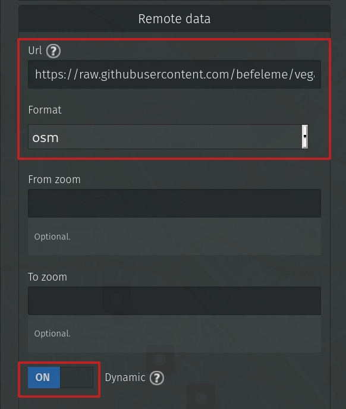

Title: Draw a map! (2/2)
Date: 2021-03-20 14:00
Category: OpenStreetMap
Tags: mapping, uMap, EN
Slug: draw-a-map-2-2

In the [first part](./draw-a-map-1.html) you've learned about a tool called uMap. 
For some use cases a static map is enough.

OpenStreetMap is however very much alive and changes every second.
You may want to reflect those changes in your map.
Real time requests aren't feasible with current OSM state. 
If you try to send too many of them, you may end up with a ban on Overpass servers.

Let's say you'd like to update the map nightly, which shouldn't be too hard on Overpass.

## Where to for lunch?

My goal was to display all restaurants where I can eat in the region I live.
I wanted to filter for places which serve *plant-based menu* and display them on the map.
This way I not only know where to go for lunch, but also have a visual clue when it comes to updating non-existent places. 

Let's see how to proceed with such a map.

At this point you know:

- how to ask for the data you're interested in
- how to take the data from Overpass and put them in the map

What's the goal?

Automate the process and set it to ask for data periodically, every night.

## Git scraping for the rescue

You need a machine to perform some actions in the middle of the night.
The actions contain:

- requesting the data
- storing the data

### Where to store data?
For small data samples (like restaurants in your city), [GitHub](https://github.com/) can be a place of choice.
Just remember, GitHub was not designed to be free database. 
It won't let you store too much data in a repository.

### How to request data?
There is a technique called [Git scraping](https://simonwillison.net/2020/Oct/9/git-scraping/) shown by [Honza Javorek](https://honzajavorek.cz/) on one [Pyvo](https://pyvo.cz/). 

GitHub provides a tool called GitHub Actions which you can set up to perform various tasks for you.
Like for example... calling an API request and, in case the response file is changed, commit it automatically to a repository.

> **Git note**
> 
>If you're reading this and struggle with terms like 'repository' or 'commit', consider learning about Git basics first, for example [here](https://www.freecodecamp.org/news/learn-the-basics-of-git-in-under-10-minutes-da548267cc91/).

#### How to get a valid URL to send requests?
Once you've built an Overpass query that satisfies you, look for **Export** option in the menu.
Then find **Query** and click on _compact_ in **Convert to...** option. A new pane with the query will open. 
Copy the displayed query and try it in another tab. 
It should provide JSON data - you're set.  

To make things as easy as they can be, let's use bash command `curl` to make a request. 
`curl` will take a URL to call as an argument, and the output will be directed to a file, like this:

`curl 'url_to_request' > my_data.json`

The actual example is a bit longer, mainly because API parameters in Overpass are quite verbose.
Check my script [run.sh](https://github.com/befeleme/vegan_JMK/blob/main/run.sh). I call for 4 sets of data with 5-minute breaks in between.

The process of calling and storing takes place automatically. 
See my configuration file in [scrape.yml](https://github.com/befeleme/vegan_JMK/blob/main/.github/workflows/scrape.yml).
Let's ignore Python rows as they are not necessary for this project.
The configuration says that each day at 2.15 AM an Ubuntu machine copies the code from my repository, executes the `run.sh` script and in case the files have changed, commits them to repository as user *Automated*.  

So the script runs every night but it commits now and then - when someone changes the restaurant's data. 
The big benefit is I can track changes to the [date](https://github.com/befeleme/vegan_JMK/commit/5cad11ed48baee9880c5b60d0464ccf19fedc46b).

As a result there are several JSON files in `output` folder.
Let's connect them with the map!

## Point the map to remote data

Pasting data to the map as it was shown in the previous post isn't the right way here.

I want to display different layers of data (100% plant-serving places, places with some options...- one layer per each JSON file from my repository).
For each layer I want to set different color and properties. 
This is achieved by setting **Remote data** in Layers.

There is a field for URL with data. That's great. As it happens, we have an accessible remote storage of the data - we only need to paste the URL to **raw** data, so that uMap parses it correctly.
You'll get the raw data by clicking on the respective button.

Fill in the marked fields and click **Save**.

One layer of data is imported and, what's more, it will be updated every time someone changes underlaying information.

## The result

<iframe width="100%" height="600px" frameborder="0" allowfullscreen src="//umap.openstreetmap.fr/en/map/vege-jmk_557579?scaleControl=false&miniMap=false&scrollWheelZoom=false&zoomControl=true&allowEdit=false&moreControl=true&searchControl=null&tilelayersControl=null&embedControl=null&datalayersControl=true&onLoadPanel=none&captionBar=false&datalayers=1584303%2C1584302%2C1584304%2C1581977%2C1581976%2C1581961%2C1581969#15/49.1991/16.6104"></iframe>
<a href="//umap.openstreetmap.fr/en/map/vege-jmk_557579">See full screen</a>

 
