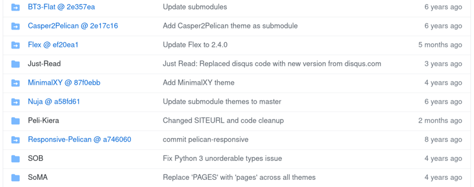

Title: Git submodules
Date: 2021-05-05 17:19
Category: Git
Tags: EN, coding, tools
Slug: git-submodules

As I swim through the new waters, some nasty gotchas wait for me in the currents.

## Overture

Many times have I encountered a GitHub repository with some folders that look more like a hyperlink to another folders.

An example from [Pelican themes](https://github.com/getpelican/pelican-themes) looks like that:



Notice the icons with the arrows and kind of weird name of the blue entries.

## Tricky part

I wasn't paying much attention to them until I had to. 

**Scenario**

You want to clone a repository containing those linked folders.
So you run `git clone git://<your-repo-url>` expecting the whole repository will be cloned to your disk.
It is, but without those linked ones. 
They are empty, no files, nada.

**What not to do**

Enter the empty folders and try to `git pull` the contents. This won't help.

**What is possible to do**

Ask a more senior colleague if you have one nearby.
Alternatively, ask your favorite search engine how to download the folder contents.
The only problem is how to phrase the query to actually find anything meaningful. 
I did, it took me enough time to see some sense in publishing the note.

**What actually to do**

Look for *git submodule* or just read [this chapter](https://git-scm.com/book/en/v2/Git-Tools-Submodules) from excellent Pro Git book.

Go to your project root directory and run the commands:
```
git submodule init
git submodule update
```

The empty folders shall be populated now. :)