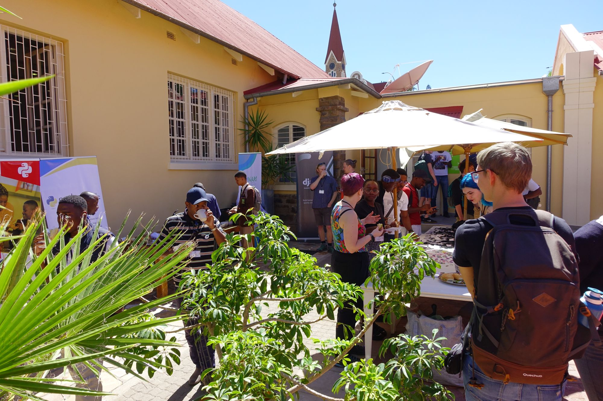
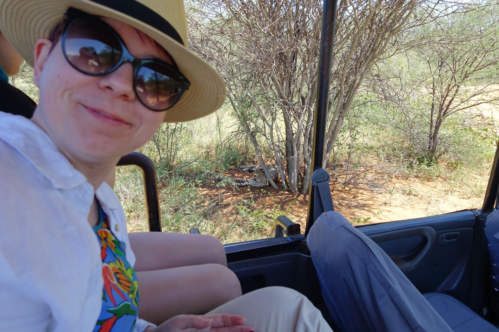
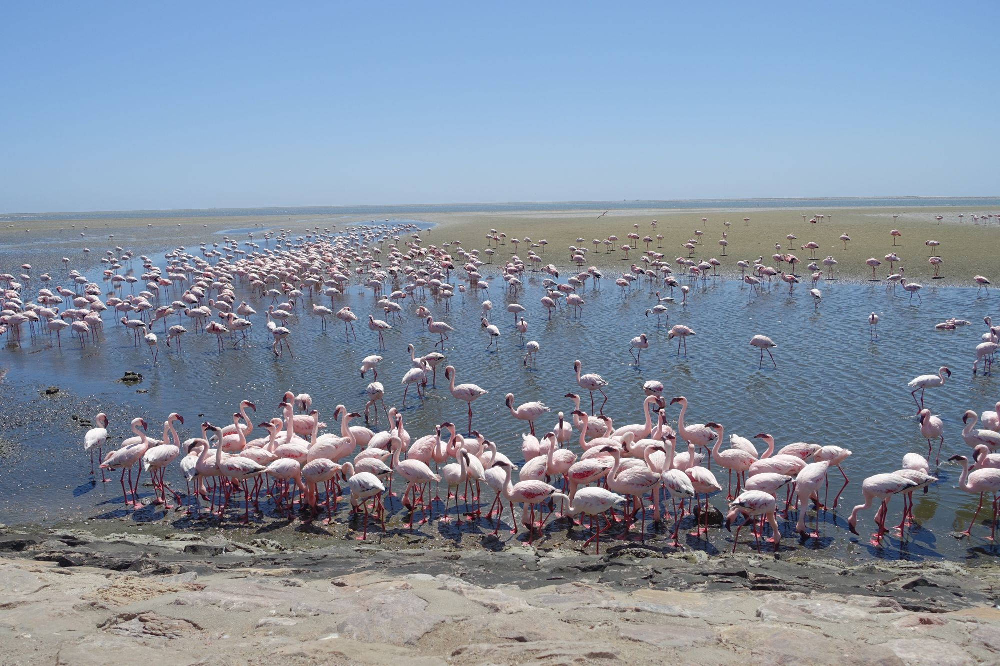

Title: PyCon Namibia - Looking back at 2024
Date: 2025-01-23 19:34
Category: Python
Tags: EN, community
Slug: pycon-namibia-looking-back-at-2024

## Power of the community

Working with Python and largely in an open-source space brings perks.
Python is truly unique for the communities that form around it.
People crafting webs, moving science forward, powering machine learning, geeks
and passionates create a very diverse crowd.
It took me at least three repetitions from Honza Javorek about his Namibian
experience to start thinking: what if?

So in 2024, when I heard Mia from the Czech Python community is also thinking of
going, we went for it: I sent a talk proposal which was accepted.
The talk was about leveraging Advent of Code
to progress beyond the beginner's phase of a programmer - an English translation
of the talk I delivered on PyCon CZ 2023 ([slides](https://befeleme.github.io/pycon-na-24/)).

Honestly, this was the best way to arrive in Namibia. The local community will
always stay in my heart! The folks there are one of the most welcoming, warm and
open people I've ever met.

After 4 days of the conference, we packed, borrowed a car and headed North to
Etosha National Park. Let me just say: it can't be missed if you're in Namibia.
We stopped at the Cheetah Conservation Fund on our way there, which I can
wholeheartedly recommend. We've seen the desert and the ocean, got caught in a heavy
rainfall which lasted around 30 minutes, met countless antelopes and baboons, 
and drove over 1400 km in total.
I haven't felt so relaxed in years, probably.

## Supporting the Namibian community

The following advice is tailored for a fellow Westerner, it contains Assumptions.

We didn't know it before, but the Namibian community is very young, both in
terms of age, and maturity. The whole IT industry is emerging.
Don't be fooled by the appearances though, folks know exactly which problems
they want to tackle using technologies. I've seen an excellent workshop on using
machine learning and pattern recognition to find oases in the desert.
If you plan to come to the conference, in my opinion the best way to contribute
on spot is to bring ideas about technologies with practical application.
Think of constraints when designing your talk or workshop: internet access cannot be
taken for granted, think of services available for free rather than paid.

You can also support PyCon Namibia directly. [An amount of 20 EUR](https://na.pycon.org/tickets/)
will pay for one person's ticket.

## Footnotes

I've got a lot of mixed feelings about responsible traveling to post-colonial
countries as a European tourist, which is a topic for a long research and even longer essay,
so maybe one day, when I find the proper words.
Nevertheless, my advice no. 1 for anyone thinking of traveling to places which
are very different from their homeland, is: find locals,
listen and learn from them, contribute if you can, don't be just a tourist.
Python happens to be a great social glue!

