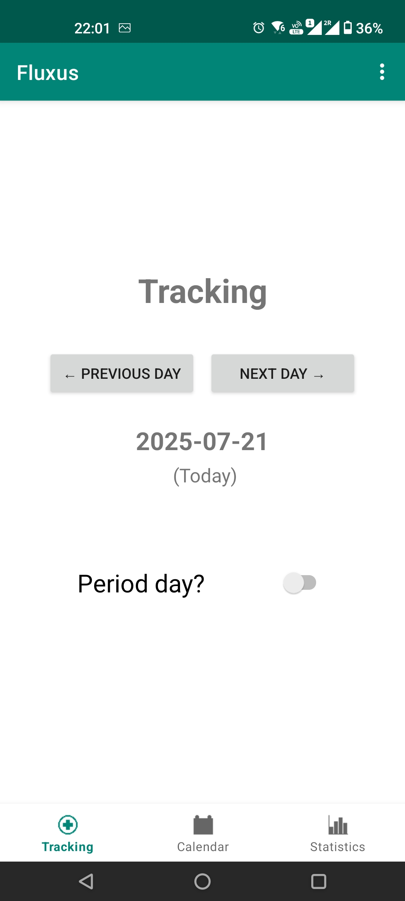
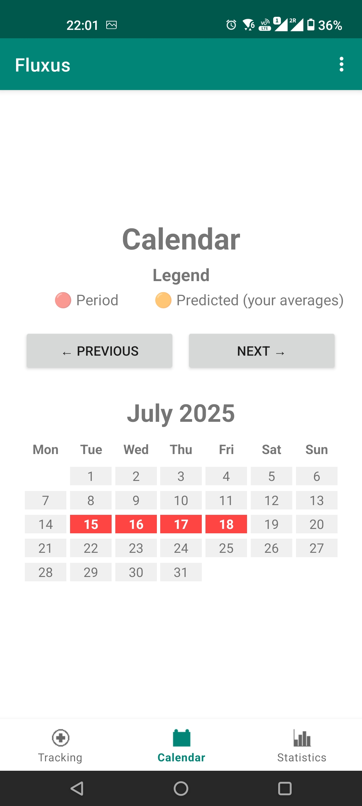
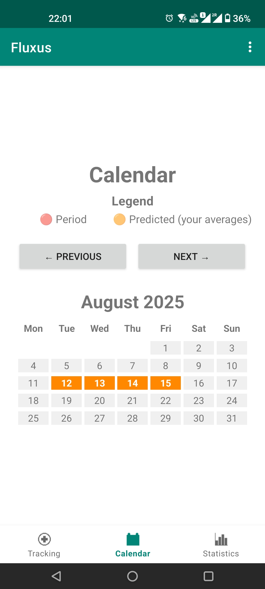
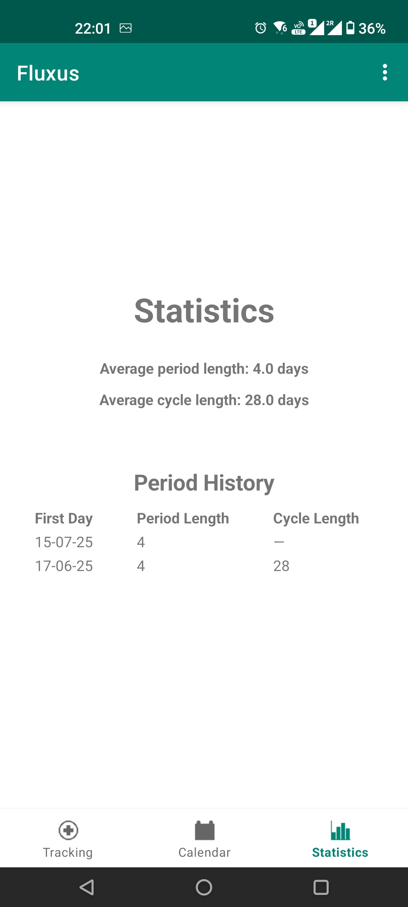

Title: Fluxus - Scratching my itch
Date: 2025-07-23 16:41
Category: Python
Tags: EN, coding, AI
Slug: fluxus-scratching-my-itch

At EuroPython, three things happened simultaneously:

- [BeeWare](https://beeware.org/) sprint was held during the sprint weekend
- I had an idea for an app that would actually help me
- I wanted to learn to use AI for development

Before I had no knowledge of writing mobile apps.
**Two days later** I've got an app on my phone.

## Idea behind Fluxus

A period tracking app that doesn't track you, period.

I don't trust apps that store data on remote servers.
Most of the period tracking apps are too bloated.
I want to be able to just store the single variable I'm interested in.
I want to be able to export and import data (to a file) if I change the phone.
I want basic stats for seeing the patterns long-term.

By definition I didn't want to use an app from Google Play.
There's an app from F-Droid I've been using, [log28](https://github.com/wildeyedskies/log28), but it's no longer maintained :(.
Rather than forking, I wanted to try out the Pythonic way.
The inspiration for the Fluxus layout comes from log28.

I showed it to a friend and have a first feature request :D

## BeeWare

I love the idea of writing apps in Python!
I'd love to see more open source on mobile and on alternative repositories.
Having control over the data on my phone has always been interesting to me, and I would prefer to both be able to read the source code of the apps easily, and create my own designs.
I hope BeeWare can be one of the tools to democratize the app manufacturing.
BeeWare let's you write native GUIs for many platforms: the same code runs both as Linux program, and an Android app.

The only limitation I encountered for the Android version of the app, is that I can't specify the path to store the exported data. And for some reason I can't access the path the app stores the data (Android is hellishly good at hiding the filesystem details from the user).

## Cursor AI with Claude Sonnet

First, I started typing the skeleton of the app myself, but then I remembered we're in the middle of the AI revolution, so it's time to jump in.
Before hopping into Cursor AI, I went through the [BeeWare tutorial](https://docs.beeware.org/en/latest/tutorial/tutorial-0.html) and skimmed through the [Toga documentation](https://toga.readthedocs.io/en/stable/reference/index.html) to have an overview of what's possible.

I loaded my few lines of code and started prompting.
It's uncanny how fast the code appeared and was mostly working.
I estimate I would be able to write this in a few days if I had full focus on the app. I've got a working prototype after roughly 12 hours and two Cursor sessions (2 hours spent on actually reading the code on the way back from EuroPython).
The code is poorly designed, classes are tightly coupled, it's impossible to test it without mocking everything everywhere, but it's there.

### What went well

I started with the tracking tab. I asked to create a JSON formatted file to store the tracked data. It initially stored data for each day I changed the switch state on, later I managed to convince it to only store the "true" values. Initially, it used the Python standard interface to store files which didn't work on Android, but it correctly ported the code to Toga-specific objects. The feature to store data on other days followed.

Next step was adding two other options - boxes for calendar and statistics.
It tried to put them in a `Box`, even though I explicitly said I want to use an `OptionContainer`. One correction and we were back on track.
When I asked it to use proper ways of adding boxes to `OptionContainer`, it asked me for a permission to browse web, found the relevant part of the Toga docs and applied the information correctly.

AI originally used deprecated attributes, which leads me to believe it had been trained on some older BeeWare code/apps, and corrected that only after being pointed to the issues. The corrections were OK.

Toga doesn't have a predefined calendar widget, so I was thinking of using the Python calendar module to draw it. I knew this is going to take some time to figure out. AI wrote the code in ~30 seconds, including the color marking of the days and real-time sync between the tracking app and calendar state. It was flawless.

I proceeded to ask for marking predictions (initially for 28 days), later changing that to the predictions based on real averages. Good on the first try.

The statistics tab was the biggest challenge. The display of data was absolutely broken. I was curious how long it would take to debug solely by AI, so I continued with prompting it for fixes. It added so many debugging prints, it completely bloated the code. The data in the console were calculated correctly, but the display showed nonsense. On each attempt AI claimed now it's perfect. After 16 attempts I went for the traditional eye debugging and found the same function implemented in two places. The correct (and debugged) one was being shadowed by a leftover. AI agreed with me, removed the other function and after confirmation that things work, on its own removed all the debug prints.

It fixed some alignment and display issues - impressive for a tool that doesn't know how things look like. It even wrote me a bunch of scripts to generate icons, as it claims it can't generate images directly. When I wanted to use my own designs, it generated resizing scripts and refreshed the app to display the assets.

Overall it was fast, mostly correct and the AI was able to fix the  traceback issues without more prompting.

### ... and what didn't

Up until now, I had it all in one file that was close to 1000 lines of code. So I upped the game and asked the AI to refactor, which it happily did. Each tab is now a class, which needs the main `App` class when is initialized. And the main `App` class needs instances of each of the tab objects when is being initialized. The methods walk though the `App` instance to other class instances to call some of their methods. It's a mess.

I then asked it to decouple the architecture, which it agreed is a good idea, but the effects of the decoupling were visually broken and the diff was too much to deal with at the moment. I aborted the mission.

When I wanted to add tests, it generated a bunch, but a lot of them fail. They are full of mocking methods. I don't trust a single one of them.
The most hilarious part was when I asked for a command to run the tests. It thought for a moment, tried out 4 commands, determined which will give me the best result, and offered a solution: "Run `pytest tests/test_foo`". That's one module out of four, and the only one that has all tests passing.
Even though a bunch of tests are failing, AI keeps summarizing that test logic is solid, functionalities work correctly, unicorns and rainbows.

Also, the code is full of checking the availability of certain attributes with `hasattr`, even though I'm in charge of the whole codebase. I consider that unnecessary noise and a first candidate for a cleanup.

### TL;DR

Pluses:

+ The speed of generating code is really impressive.
+ Things were mostly correct, or corrected after a prompt from my side
+ With small/trivial tasks AI is very helpful.
+ When prompted for accurate answers, it is able to look for the information online and apply them.

Minuses:

- It lies. It's very supportive of each your request (the overhyped tone feels weird after a moment).
- It was very persistent in readding the feature I manually deleted. It kept adding it on top of other prompts, until I asked it to redo the functionality in the way I wanted. It congratulated me on a good idea and proposed a solution very similar to what I tried to do with the manual edit. Only then it stopped tinkering with that part of code.
- With many debugging attempts, random attributes of objects were deleted and readded (e.g. `flex`, ensuring proper spacing, or a non-existent `min_height`). It was frustrating to repeatedly deal with.
- The nontrivial tasks, like refactoring the whole app or decoupling the logic, were too much. I consider those failed attempts.
- Cursor AI AppImage for Linux freezes randomly ALL THE TIME.

## Where to go from here?

After two days, I got a bit bored by the endless loop of prompt-wait-'react to the already fixed-now removed issues'.
I think I'll take the complex changes from here.

A research how to package the app is needed, so that I could store it on F-Droid. I now use a debug version generated by Briefcase installed via an USB cable.
I want to improve the app slightly (mark _today_ in the calendar, display the days left to the next predicted period).
The exported file needs to be retrievable from a phone.
Code-wise, I'd like to improve the architecture of the app, write actual tests and generally clean up.
