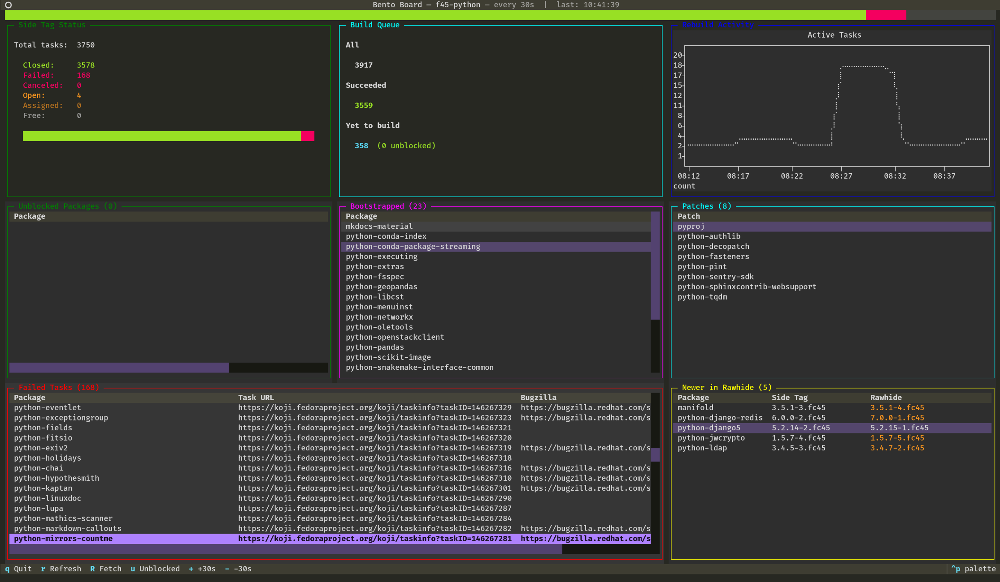

Title: Python rebuilds in Fedora
Date: 2026-06-08 17:48
Category: Fedora
Tags: EN
Slug: python-rebuilds-in-fedora

Finally some time to gather thoughts about this big endeavour I take on every year.
The third big rebuild of Python on my watch is slowly coming to an end.
I start in October with first alpha release of a new Python and end in October the next year with the final release of Python and a release of Fedora.

## Why

It's good for the **community**: we can report and fix issues in libraries as soon as they appear.
(Some upstream maintainers don't care about alphas and don't like our reports, so I try to remember which ones to avoid in the initial months).

It's good for **CPython**: we can report regressions and bigger incompatibilities before they become a big issue.

It's good for **Fedora**: one of its values is "first": it's always been a forefront Linux distribution when it comes to adopting novelties, its userbase is used to things changing and collaborates with upstreams by design (that's another Fedora's principle: upstream first).

It's good for **Python maintainers** at my company: we know new Python plays well with the rest of the ecosystem. It will eventually become a part of the enterprise distribution, and by that time, it will be battle tested.

## How

There's a [copr](https://copr.fedorainfracloud.org/coprs/) repository where the new Python acts like a main one.
There I keep building down the dependency tree.
We've got a [tool](https://github.com/fedora-python/whatdoibuild) to query the repositories and find what is currently unblocked and can be built which is a cornerstone of the whole endeavour.
Additional tooling consists of [more scripts](https://github.com/befeleme/mini-mass-rebuild) to solve other arising issues. (I must not lose my zsh history).

Month after month, release after release, I keep reporting issues, fixing them if I can, unblocking chunks of the tree and tend to the whole thing.

With around 4000 Python packages in Fedora, I aim for having under 500 "waiting" before the actual rebuild.
That's when the rebuild actually starts and is done in Fedora build system (Koji) side tag (temporary pocket for isolated changes, intended to be merged to the main flow).
I test critical paths - groups of essential packages for different Fedora flavors, and at the end of the rebuild we spawn an OpenQA instance with our changes.
The last steps require cooperation with the friendly Fedora QA and Infra teams, always flawless.

The last part, the Koji rebuild, is what we aim to do in the shortest time possible. It's the third time I have met with Miro at his place, where we set up a garden office and worked through the queue with enough of both the oxygen and caffeine each day. Bára's excellent cooking has sustained us each time and I can't be grateful enough for her work put in the yummy vegan dishes <3.

## Loose ends

There's still a lot of tribal knowledge in the process.
When the real rebuild happens, we just work. When we're done, we're exhausted and the last thing we want to do is documenting the steps.
However, I do my best to update and extend a [team "wiki"](https://hackmd.io/xsFrXJnaR_26QSzjBomCpg) about the whole process.

We only test one architecture: x86_64, but the rebuild happens on all arches supported on Fedora. This always causes some unexpected issues.
However, bloating the copr repository with 5x as many chroots is too much of a tradeoff.

There's no way to "block" maintainers from updating their packages when we build things in the side tag. This always leads to inconsistencies and artificial bumping the package releases. Well.

The dashboard I was using this year needs some improvements. Overall it's a good addition to the process.

## Tight ends

It's this kind of a job that works best in a highly focused environment and ideally in at least two people. I would be left in a much worse state if I was doing it alone in my home office, let alone in the actual one.

Will I do it again? Probably.
But for now it's time to touch some grass.

You can see some statistics assembled every night at [the status page](https://status.fedoralovespython.org/).
